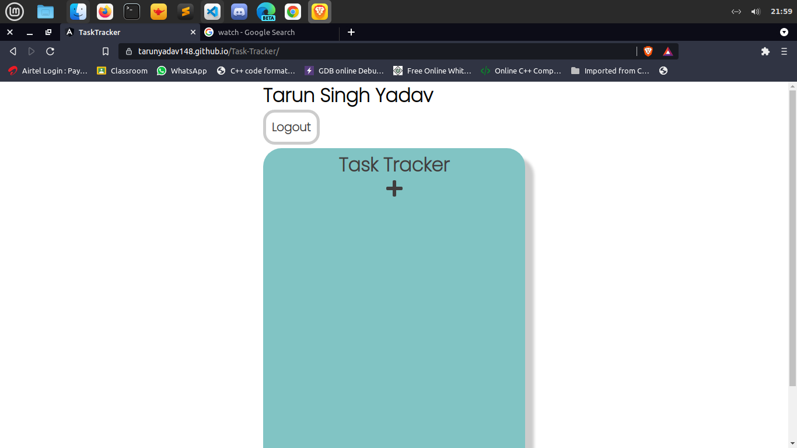

# TaskTracker

<a href="https://tarunyadav148.github.io/Task-Tracker/">Task-Tracker(Deployed App)</a>

## Development server

Run `ng serve` for a dev server. Navigate to `http://localhost:4200/`. The app will automatically reload if you change any of the source files.

## Build

Run `ng build` to build the project. The build artifacts will be stored in the `dist/` directory.

